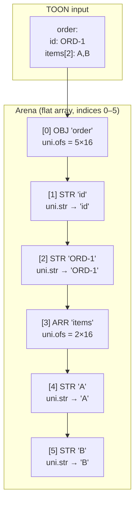
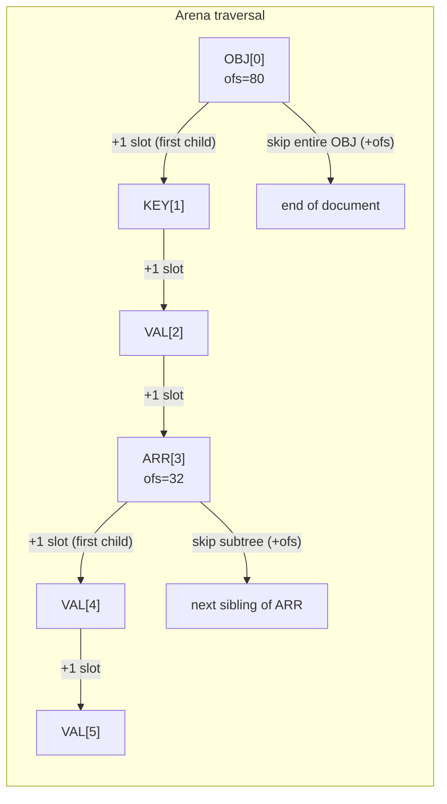
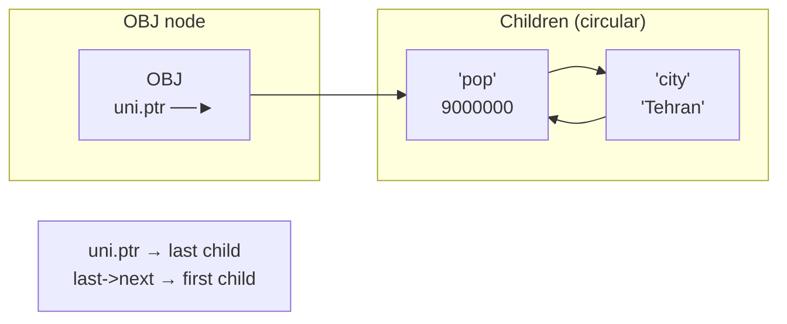
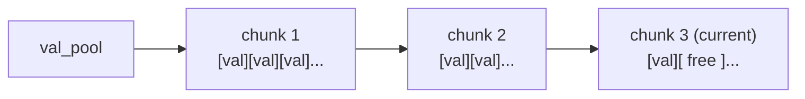
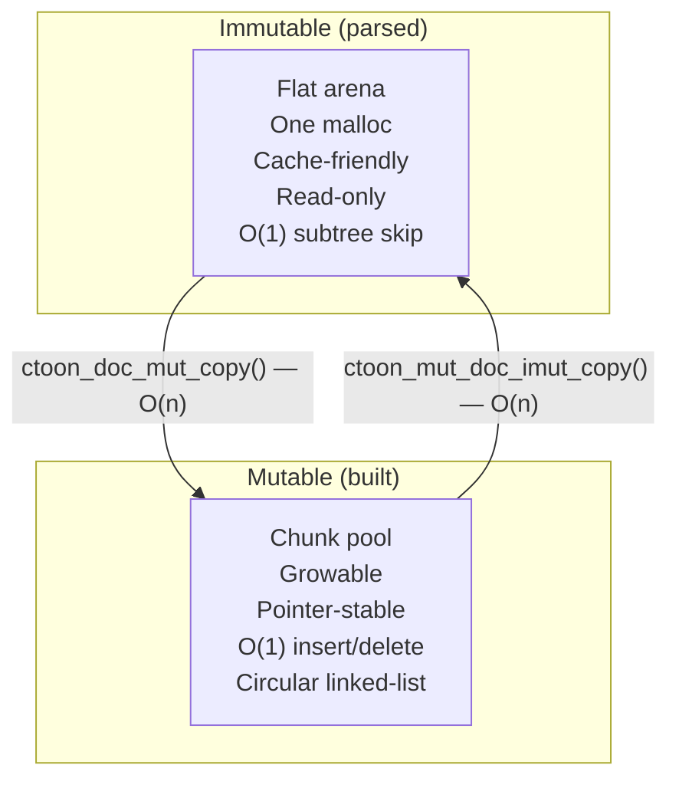
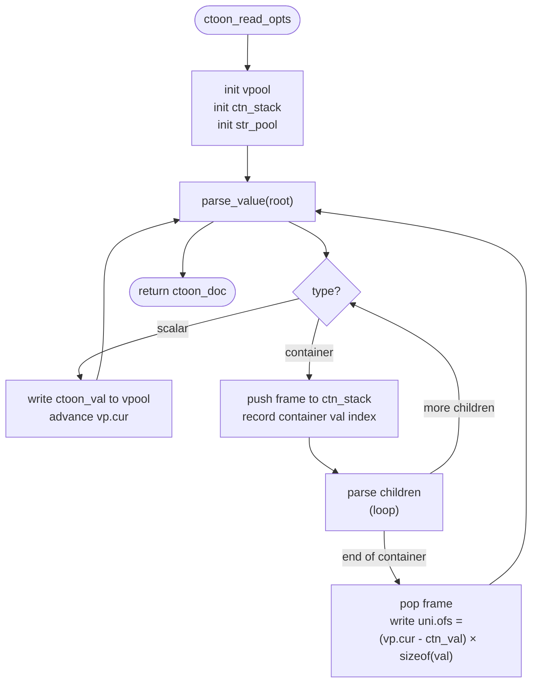
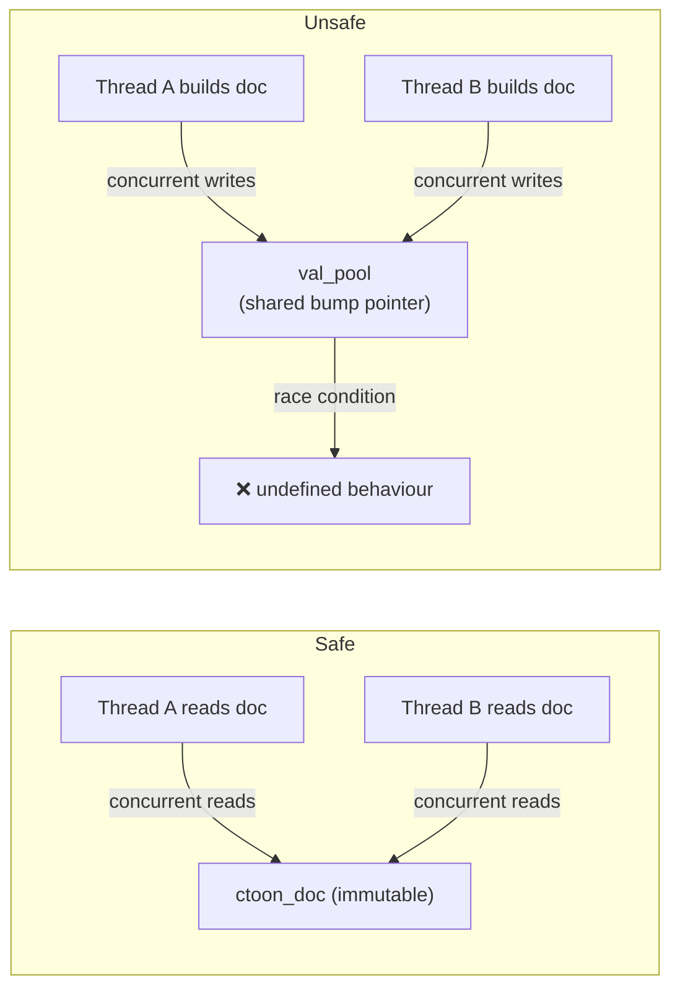

# CToon — Technical Report

## 1. Overview

CToon is a high-performance C implementation of the TOON serialisation format. Its design priority is **zero-copy parsing** and **minimal allocation overhead** — the same goals that motivated jq, RapidJSON, and yyjson. This report covers the internal data structures, memory layout, parsing algorithm, and the architectural differences between the immutable and mutable document models.

---

## 2. Value Representation (`ctoon_val`)

Every value in a parsed document occupies exactly **16 bytes** on all platforms:

```
struct ctoon_val {
    uint64_t     tag;   // type + subtype + length  (8 bytes)
    ctoon_val_uni uni;  // payload                   (8 bytes)
};

union ctoon_val_uni {
    uint64_t    u64;   // unsigned integer
    int64_t     i64;   // signed integer
    double      f64;   // IEEE-754 double
    const char *str;   // pointer into input buffer (zero-copy)
    void       *ptr;   // generic pointer (mutable tree links)
    size_t      ofs;   // byte offset to next sibling (immutable tree)
};
```

### 2.1 Tag Bit Layout

The `tag` field encodes type, subtype, and (for strings/containers) length in a single 64-bit word:

```
 63                    8   7   6   5   4   3   2   1   0
 ┌──────────────────────┬───────────────┬───────┬───────┐
 │  length / child count│   (reserved)  │subtype│ type  │
 └──────────────────────┴───────────────┴───────┴───────┘
                                          [4:3]   [2:0]
```

| Bits | Field | Values |
|------|-------|--------|
| `[2:0]` | type | 0=NONE, 1=RAW, 2=NULL, 3=BOOL, 4=NUM, 5=STR, 6=ARR, 7=OBJ |
| `[4:3]` | subtype | NUM→ 0=uint, 1=sint, 2=real; BOOL→ 0=false, 1=true; STR→ 1=no-escape |
| `[63:8]` | length | string byte length **or** container child count |

This means a string's `strlen` and a container's `size()` are O(1) — they require no traversal, just a single bit-shift of the tag.

---

## 3. Immutable Document Memory Model

### 3.1 The Flat Arena (`ctoon_read_vpool`)

When `ctoon_read()` parses a document, it allocates all `ctoon_val` nodes into a **single contiguous arena** — a bump-pointer allocator called `ctoon_read_vpool`:

```
struct ctoon_read_vpool {
    ctoon_val *base;   // start of arena
    ctoon_val *cur;    // next free slot (bump pointer)
    size_t     cap;    // total slots allocated
    ctoon_alc  alc;    // backing allocator
};
```

The arena grows by 1.5× when full (`realloc`). After parsing completes, `vp.cur` is final and the arena is never modified again — making the document **read-only and pointer-stable**.

### 3.2 Depth-First Pre-order Layout

Nodes are written into the arena in **depth-first pre-order** as they are parsed. This produces a layout where a container's children are always at indices immediately following the container node:



### 3.3 Traversal via `uni.ofs`

The `uni.ofs` field of a container stores the **byte distance to its next sibling** (i.e., the first node after the entire subtree). This is the key insight that makes both traversal and skipping O(1):

```c
// first child of a container: always at ctn + 1
ctoon_val *unsafe_ctoon_get_first(ctoon_val *ctn) {
    return ctn + 1;
}

// next sibling:
//   - for a leaf:      advance by sizeof(ctoon_val) (one slot)
//   - for a container: advance by uni.ofs (skip entire subtree)
ctoon_val *unsafe_ctoon_get_next(ctoon_val *val) {
    bool   is_ctn = unsafe_ctoon_is_ctn(val);
    size_t ofs    = is_ctn ? val->uni.ofs : sizeof(ctoon_val);
    return (ctoon_val *)((uint8_t *)val + ofs);
}
```



**Complexity summary for immutable documents:**

| Operation | Complexity | Mechanism |
|-----------|-----------|-----------|
| `ctoon_arr_get(arr, i)` | **O(i)** walk, but internally **O(1) per step** | each `get_next` is one pointer add |
| `ctoon_obj_get(obj, key)` | O(k), k = key count | linear key scan |
| `ctoon_arr_size(arr)` | **O(1)** | tag >> 8 |
| `ctoon_obj_size(obj)` | **O(1)** | tag >> 8 |
| skip subtree | **O(1)** | single `uni.ofs` dereference |
| `ctoon_doc_free` | O(chunks) ≈ **O(1)** | free one or few arena chunks |

### 3.4 Zero-Copy Strings

String values do **not** copy the input buffer. `uni.str` points directly into the original input memory. This means:

- `ctoon_get_str()` is a single pointer load — no allocation, no copy.
- The input buffer **must remain valid** for the lifetime of the document.
- `CTOON_READ_INSITU` allows in-place NUL-termination for even faster string access.

---

## 4. Mutable Document Memory Model

### 4.1 Circular Doubly-Linked List

The mutable tree uses a fundamentally different layout. Each `ctoon_mut_val` has an extra `next` pointer:

```c
struct ctoon_mut_val {
    uint64_t       tag;   // same encoding as immutable
    ctoon_val_uni  uni;   // uni.ptr → first child (for containers)
    ctoon_mut_val *next;  // next sibling in circular linked list
};
```

Containers maintain their children as a **circular singly-linked list** where `uni.ptr` points to the **last** child. This gives O(1) append and O(1) prepend:



- **Append**: `new->next = last->next; last->next = new; last = new` — O(1)
- **Prepend**: `new->next = last->next; last->next = new` — O(1)
- **Size**: stored in `tag >> 8` — O(1)

### 4.2 Val Pool (Chunk Allocator)

Mutable nodes are allocated from a **chunk-based pool** (`ctoon_val_pool`). Each chunk is a `malloc`'d block; when a chunk is full, a new one is appended to the linked list. This avoids `realloc`/pointer-invalidation when the document grows:



String data is similarly pooled in a `ctoon_str_pool` of `ctoon_str_chunk` blocks.

### 4.3 Why Two Models?



The conversion between the two is always O(n) — there is no zero-copy cast because the binary layouts are incompatible.

---

## 5. Parsing Algorithm

### 5.1 Single-Pass Recursive Descent

CToon uses a **single-pass, recursive-descent** parser with an explicit container stack (no call-stack recursion for containers). The parser reads left-to-right and writes nodes directly into the `vpool` arena in pre-order.



### 5.2 Container Stack

The `ctoon_ctn_stack` tracks open containers during parsing:

```c
typedef struct {
    size_t val_idx;  // index of container node in vpool
    size_t count;    // child count accumulated so far
} ctoon_ctn_frame;
```

When a container closes, the parser:
1. Pops its frame
2. Computes `uni.ofs = (vp.cur - &vpool[val_idx]) * sizeof(ctoon_val)`
3. Writes `count` into the tag's upper bits

This is the moment the flat-arena "skip" offset is finalised.

### 5.3 String Handling

Strings are **not copied** during parsing. The parser records a pointer (`uni.str`) directly into the input buffer and stores the byte length in the tag. Escape sequences are handled lazily — the `CTOON_SUBTYPE_NOESC` flag marks strings that require no unescaping, so `ctoon_get_str()` can return the pointer directly.

---

## 6. Float Serialisation (Ryu / Schubfach)

For float-to-decimal conversion, CToon uses a port of the **Schubfach algorithm** (as implemented in yyjson). The key functions:

- `f64_bin_to_dec()` — converts IEEE-754 significand/exponent to shortest decimal using cached `pow10_sig_table` + `u128_mul` / `u128_mul_add`
- `write_f64_ryu()` — formats the result with correct decimal-point placement and scientific notation fallback
- `write_u64_len_16_to_17_trim()` — fast 16-or-17-digit writer with trailing-zero trimming

The algorithm guarantees the **shortest round-trip** representation — the minimal number of decimal digits that uniquely identifies the original `double` bit pattern.

---

## 7. Allocator Architecture

CToon never calls `malloc` directly. All allocation goes through `ctoon_alc`:

```c
typedef struct {
    void *(*malloc) (void *ctx, size_t size);
    void *(*realloc)(void *ctx, void *ptr, size_t old_size, size_t size);
    void  (*free)   (void *ctx, void *ptr);
    void  *ctx;
} ctoon_alc;
```

Three built-in allocators are provided:

| Allocator | Use case |
|-----------|----------|
| `CTOON_DEFAULT_ALC` | wraps system `malloc`/`realloc`/`free` |
| `ctoon_alc_pool_init()` | fixed-size bump allocator from user-supplied buffer (zero heap usage) |
| dynamic pool | chunk-based pool for mutable documents |

Passing a custom allocator allows CToon to be used in embedded environments, arenas shared across threads, or memory-mapped files.

---

## 8. Thread Safety



The immutable document is **fully thread-safe for concurrent reads** — it is never modified after `ctoon_read` returns. The mutable document and its underlying pool are **not thread-safe** — the bump pointer and linked-list manipulation require external locking if shared across threads.

---

## 9. JSON Interop

When `CTOON_ENABLE_JSON=1` (default), CToon embeds a JSON reader and writer:

- **`ctoon_read_json()`** parses JSON directly into the same flat-arena immutable format — the resulting `ctoon_doc` is indistinguishable from a TOON-parsed document.
- **`ctoon_doc_to_json()`** serialises an immutable doc to JSON in a single O(n) pass using `cj_doc_write`, which understands the flat-arena layout and `uni.ofs` skip offsets.
- **`ctoon_mut_doc_to_json()`** first calls `ctoon_mut_doc_imut_copy()` (one O(n) traversal of the circular linked-list) then delegates to `cj_doc_write`. The temporary immutable copy is freed immediately after serialisation.

---

## 10. Summary

| Property | Immutable (`ctoon_doc`) | Mutable (`ctoon_mut_doc`) |
|----------|------------------------|--------------------------|
| Storage | Flat contiguous arena | Chunk-linked pool |
| Node layout | Pre-order, depth-first | Circular linked-list |
| Sibling navigation | `uni.ofs` byte offset | `next` pointer |
| Append child | N/A (read-only) | O(1) |
| Skip subtree | O(1) | O(subtree size) |
| `arr_size` / `obj_size` | O(1) tag read | O(1) tag read |
| `doc_free` | O(1) (one arena free) | O(chunks) |
| Thread-safe reads | ✅ | ✅ |
| Thread-safe writes | N/A | ❌ |
| Convert to other | O(n) deep copy | O(n) deep copy |