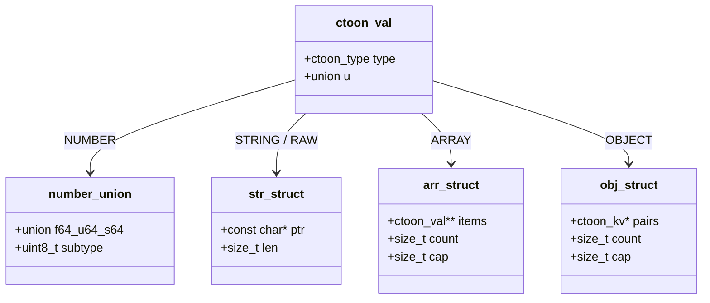
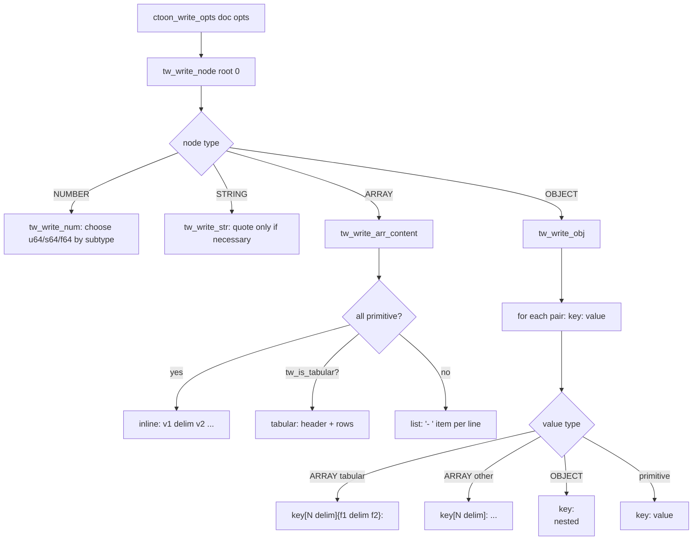
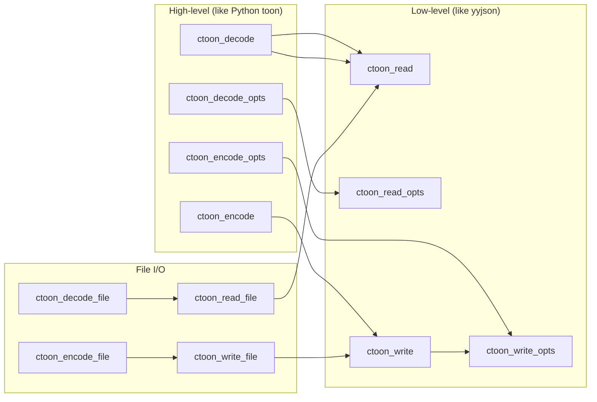

# CToon – Technical Reference

## Overview

CToon is a C implementation of the [TOON format](https://github.com/toon-format/spec) —
a compact, human-readable serialization format optimized for LLM token usage.
It achieves 30–60% token reduction versus JSON while maintaining readability.

---

## Architecture

```
Input (TOON text)
       │
       ▼
┌─────────────┐
│   Scanner   │  tp_parse_* — lexes/parses into ctoon_val tree
│  (ctoon.c)  │  no separate AST phase; builds directly into arena
└──────┬──────┘
       │ ctoon_val* tree in arena
       ▼
┌─────────────┐
│    Arena    │  chunk-based arena allocator (calloc chunks, no individual free)
│ Allocator   │
└──────┬──────┘
       │
       ▼
┌─────────────┐
│  Serializer │  tw / tw_write_* — traverses ctoon_val tree, writes TOON text
│  (ctoon.c)  │  options-aware: delimiter, indent, length-marker
└─────────────┘
```

---

## Data Structures

### Arena Allocator

```
ctoon_arena
  └─ ctoon_arena_chunk → ctoon_arena_chunk → ...
         │                     │
     [data...]             [data...]
```

Chunks are allocated with `calloc` (zero-initialized).  
All `ctoon_val` nodes live inside these chunks.  
`ctoon_doc_free()` frees all chunks in O(k) where k = number of chunks.

**Complexity:**
- Allocation: O(1) amortized (bump pointer, new chunk only when full)
- Free all: O(k) where k = chunks ≈ O(1) for typical documents

### ctoon_val (node)

Every value in the tree is a `ctoon_val`:

```c
struct ctoon_val {
    ctoon_type type;        // tag: NULL, TRUE, FALSE, NUMBER, STRING, ARRAY, OBJECT
    union {
        struct {
            union { double f64; uint64_t u64; int64_t s64; };  // 8 bytes
            uint8_t subtype;                                     // 1 byte
        } number;           // total: 16 bytes (with padding)

        struct { const char *ptr; size_t len; } str;    // 16 bytes
        struct { ctoon_val **items; size_t count, cap; } arr;  // 24 bytes
        struct { ctoon_kv  *pairs; size_t count, cap; } obj;  // 24 bytes
    } u;
};
```

The `number` union stores exactly one of `f64`/`u64`/`s64` depending on `subtype` —
no redundant copies, no precision loss for integers ≤ 2⁶³.



---

## Parser (tp)

The parser is a single-pass recursive descent parser with no backtracking.

```mermaid
flowchart TD
    A[ctoon_read dat len] --> B{Skip blank lines}
    B --> C{First char?}
    C -->|'['| D[tp_parse_array_body]
    C -->|has ':'| E[tp_parse_object depth=0]
    C -->|else| F[tp_parse_primitive]

    D --> G{has fields?}
    G -->|yes '{'fields'}'| H[tp_parse_tabular_rows]
    G -->|inline| I[tp_parse_inline_array]
    G -->|EOL| J[tp_parse_list_items]

    E --> K{key done, next char?}
    K -->|'['| D
    K -->|':'  EOL| L[tp_parse_object depth+1]
    K -->|':'  value| F

    J --> M{next line depth+1 not '-'?}
    M -->|yes| N[add field to object item]
    M -->|no or '-'| O[next list item]
```

**Complexity:**
- Time: O(n) — each byte read at most twice (once for line scanning, once for parsing)
- Space: O(d) stack depth where d = maximum nesting depth

### String Parsing

Strings are parsed in two passes:
1. Measure unescaped length
2. Allocate in arena, unescape into buffer

No heap allocation per string — all go into the arena.

---

## Serializer (tw)



**Tabular detection** (`tw_is_tabular`):
- All items must be objects
- All objects must have the same keys in the same order
- All values must be primitives (no nested arrays/objects)
- O(n·k) where n = rows, k = columns

**String quoting rules** — a value is quoted if:
- Empty string
- Leading/trailing space
- Starts with `"- "` (list marker)
- Contains: `"`, `\`, `\n`, `\r`, `\t`
- Contains the active delimiter
- Contains `:`, `[`, `{`, `}` (structural)
- Is a reserved literal: `null`, `true`, `false`
- Looks like a number (would be misread on decode)

**Bracket format:**
- Comma delimiter (default): `[N]` or `[#N]`
- Other delimiters: `[N|]`, `[N\t]` etc. — delimiter character inside bracket per spec

**Complexity:**
- Time: O(n) — each node visited once
- Space: O(d) stack depth + O(output) dynamic buffer (doubles on growth)

---

## API Design



`ctoon_decode/encode` are thin aliases for `ctoon_read/write` — they exist so user
code reads naturally (matching the Python API) without any runtime overhead.

---

## Object Iteration

Two iteration styles:

| Style | Thread-safe | Use case |
|-------|-------------|----------|
| `ctoon_obj_get_key_at(obj, i)` | ✅ Yes | Recursive traversal (CLI JSON converter) |
| `ctoon_obj_iter_get/next` | ❌ No (global state) | Simple single-level loops |

The index-based accessors were added specifically because `ctoon_obj_iter_*` uses
a global `s_obj_iter` struct, which gets corrupted when recursing into nested objects.

---

## Memory Layout Example

For `{"name":"Alice","age":30}` (30 bytes input):

```
Arena chunk (64 KiB):
┌────────────────────────────────────────────────┐
│ ctoon_val [OBJECT]  24 bytes                   │
│   pairs → ctoon_kv[2]  32 bytes                │
│     [0].key → ctoon_val [STRING "name"]  32 B  │
│     [0].val → ctoon_val [STRING "Alice"] 32 B  │
│     [1].key → ctoon_val [STRING "age"]   32 B  │
│     [1].val → ctoon_val [NUMBER 30]      16 B  │
│ string data: "name\0Alice\0age\0"         14 B  │
└────────────────────────────────────────────────┘
Total: ~182 bytes in arena (vs 30 bytes input — 6× overhead typical for parse trees)
```

All freed in one `free()` call.

---

## Complexity Summary

| Operation | Time | Space |
|-----------|------|-------|
| Parse TOON | O(n) | O(n) arena + O(d) stack |
| Serialise to TOON | O(n) | O(output) |
| `ctoon_obj_get` (linear scan) | O(k) | O(1) |
| `ctoon_obj_get_key_at` | O(1) | O(1) |
| `ctoon_arr_get` | O(1) | O(1) |
| `ctoon_doc_free` | O(chunks) ≈ O(1) | — |
| Tabular detection | O(n·k) | O(1) |

n = total nodes, d = max nesting depth, k = keys per object

`ctoon_obj_get` is O(k) linear scan (no hash map). For objects with many keys this
is a known limitation; for typical API/LLM payloads (< 50 keys) it is negligible.

---

## C++ Binding (ctoon.hpp)

`ctoon.hpp` **shadows** `ctoon.h` completely — no `ctoon_*` function needs to be
called directly after including it.

```cpp
// All of ctoon.h is wrapped:
ctoon::Document doc = ctoon::decode("name: Alice\nage: 30");
ctoon::Value root = doc.root();
std::string name = root["name"].asString();   // no ctoon_obj_get needed
std::string toon = doc.encode();              // no ctoon_encode needed

// Options:
ctoon::EncodeOptions opts;
opts.delimiter = ctoon::Delimiter::Pipe;
opts.flag = ctoon::WriteFlag::LengthMarker;
std::string toon2 = doc.encode(opts);
```

`Document` owns the `ctoon_doc*` via `shared_ptr<ctoon_doc>` with `ctoon_doc_free`
as the deleter. `Value` is a non-owning view (pointer into the arena) and must not
outlive its `Document`.

---

## Known Limitations

1. **Object lookup O(k)** — linear scan, no hash table. Acceptable for typical use.
2. **`ctoon_obj_iter_*` non-reentrant** — uses global state, not safe for recursive traversal. Use index-based accessors instead.
3. **`TOON_INDENT` fixed at 2 in parser** — the decode `indent` option is plumbed through the options struct but the parser hardcodes 2-space detection. Customizable indent decoding is future work.
4. **No `keyFolding` / `expandPaths`** — spec v1.5 features not yet implemented in C.
